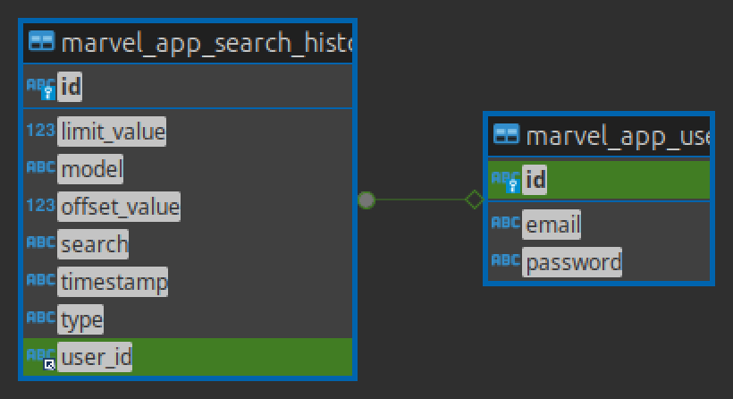

# Evaluación Técnica - Marvelpedia

Este repositorio sirve como compilación de las partes desarroladas en el sistema marvelpedia. A continuación se detallarán aspectos importantes del uso, instalación, arquitectura y pruebas de resultados para constatar el trabajo realizado en esta prueba.

- [Evaluación Técnica - Marvelpedia](#evaluación-técnica---marvelpedia)
  - [Arquitectura general del proyecto](#arquitectura-general-del-proyecto)
    - [Base de datos](#base-de-datos)
    - [Webservice](#webservice)
      - [Datos importanes - Varibles de entorno](#datos-importanes---varibles-de-entorno)
      - [Datos importantes - Instalación](#datos-importantes---instalación)
      - [Sitema de autenticación - JWT token](#sitema-de-autenticación---jwt-token)
      - [Estádares en rutas - General Response](#estádares-en-rutas---general-response)
      - [Rutas y Respuestas](#rutas-y-respuestas)
    - [Cliente Web](#cliente-web)

## Arquitectura general del proyecto

Marvelpedia esta contituido por 3 grandes elementos que coexisten unos con los otros: La base de datos, el web service y el cliente web. Todos se encuentran separados por capas físicas y lógicas, permitiendo  una alta escalabilidad y flexibilidad al momento de estar desarrollando.

Una representación simple pero efectiva de esta arquitectura sería la siguiente:


### Base de datos

La base de datos esta construida en mySQL version 9. Ya que la fuente de datos primaria del proyecto, no es esta base,  solo posee dos tablas; una para el control de usuarios, y otra para el registro del historial de busquedas por persona.

El diagrama realacional que representa esta base, es el sigueinte:


> Los scripts ddl de la base se compartiran en el repositorio con le nombre de ddl.sql (Obtenidos de DBEAVER)

El uso de ambas tablas se limimta al consumo y devolución de información, no se realizar logíca de negocios muy compleja.

Para que la aplicación pueda hacer uso de la base, solo hace falta que existan dichas tablas. 

### Webservice

Este componete es una servicio montado en Spring Boot, versión 3.4.0, junto al gestor de paquetes y proyectos Maven.

En este proyecto se utilizaron las siguientes librerias:

- spring-boot-starter-data-jpa: Starter para JPA y persistencia de datos.
- spring-boot-starter-security: Starter para seguridad con Spring Security.
- spring-boot-starter-validation: Starter para validación de datos.
- spring-boot-starter-web: Starter para aplicaciones web RESTful.
- mysql-connector-j: Conector JDBC para MySQL.
- lombok: Herramienta para reducir boilerplate en Java (getters, setters, etc.).
- spring-boot-starter-tomcat: Starter para usar Tomcat como contenedor web.
- modelmapper: Librería para mapear objetos de manera sencilla.
- jjwt-api: Librería para trabajar con JWT (JSON Web Tokens).
- spring-cloud-starter-openfeign: Starter para cliente HTTP declarativo con OpenFeign.

#### Datos importanes - Varibles de entorno

Si se necesita instalar el servicio, ya sea on premise o cloud, se deben de tomar en cuenta las siguientes Varliables de entorno: (Ninguna de estas debería de ser pública)

- DBURI: URI del la conexión tipo jdbc de la base de datos
- DBUSER: Usuario de la base de datos
- DBPASS: Contraseña del usuario con quien se desea iniciar sesion.
- JWTSECRET: Cadena secreta con el que sse cifran los token JWT
- MARVELPRIVATE: LLave priivada del servicio de Developer Marvel
- MARVELPUBLIC: LLave public  del servicio de Developer Marvel

En el archivo application.yml se encuentran las variables definidas. 

#### Datos importantes - Instalación

Para instalar el sistema se puede realizar de diversas maneras:

- Directamente desde el IDE. Siendo esta la solución menos llamtiva por su baa escalabilidad empresarial
- Servicio Cloud: En la nube existen diverson servicios como heroku o railway que  permiten la intalación del sistema, e incluso brindan soluciones para bases de datos. En estos casos normalemnte el seploy viene de la mando con un flujo de CI/CD o alguna automatización. Normamente se trabaja con Docker (Validar archivo dockerfile en repositorio).

- Generar War: Como @utima opción se puede generar el archivo ejecutable de java a través de maven para levantar el servicio en algun servidor web como tomcat.

> mvn clean package -DskipTests
  
#### Sitema de autenticación - JWT token 

La autenticación dentro la aplicación se realiza sin el uso intermedio de cache ni estados, sino que a partir de brindar una vez el usuario y la contraseña, se le da al usuario un token que deberá de usar para poder consumir el 95% de rutas del sistema.

Dentro del token se almacena el correo del usuario, por lo que en el momento que lo manda, se sabe certeramente quien ha ejecutado la petición, facilitando procesos o consultas redundantes a la base.

Además este metodo de redude la interación e intercambio de credenciales sensibles entre las partes involucadas del sisetma.

#### Estádares en rutas - General Response

Para todas las rutas (sin excepción) se ha implementado un DTO que permite estandarizar la comunicación entre los servicios que interactuan con la aplicación

Esta almancena el codigo de estado, un mensaje y la data resultante, siendo un esquema versátil y fácil de utilizar

```
RESPONSE 200

{
  "message": "OK",
  "data": []
}
```

#### Rutas y Respuestas

Por último, se comparte el enlace con la documentación de las rutas implmentadas en el servicio, asi como ejemplos de respuesta

> https://documenter.getpostman.com/view/34100634/2sAYBXBr74

### Cliente Web

El cliente web se realizó con la librería React version 18, complentando su funcionalidad con:
- React Router para el enrutamiento de diversas "páginas"
- TailwindCSS para un manejo declarativo y sencillo de CSS
- Ant que posee muchos componentes preconstruidos para agikizar el desarrollo
- Axios como cliente http, para realizar las peticiones
- Entre otras...

Como gestor de proyectos se utilizó Vite junto a Yarn para administrar los paquetes del sistema.

Cabe resaltar que el proyecto solo tiene una variable de entorno: VITE_BASE_URL; cuyo uso está destinado enteramente a la ruta  base de la API.

Para construir el cliente se debe de ejecutar el comando: 
> yarn run build

Y el resultado estático se generará en la carpeta ``dist``

Para modo desarrollo solo hace falta correr el comando:
> yarn run dev

Actualmente el cliente está deployado en GHPages: https://douglashdezt.github.io/marvelpedia-client/#/

> Nota importante: Se corrió utilizando node version lts (22.11.0)
